NOTE: A referenciamaszk az elozo, 1000 iteracioig futtatot GAC eredmenye

GAC_PARAMS = {
    "curvature_scaling": 1.00,
    "advection_scaling": 1.00,
    "propagation_scaling": 0.2976,
    "num_iterations": 1000,
    "max_rms_error": 0.0001
}

# patient_0001

A ket maszk kb. ugyanaz.

Result: OK

# patient_0002

Az uj maszk jobban rasimul az eredeti maszkra, nehol levagva reszeket, de ez szerintem nem rossz;

Az iteraciokat megvizsgalva konvergalt (a vegere mar minden d=50 iteracional csak par pixel valtozott adott szeleten, ami a szivizmot tartalmazta)

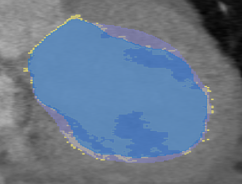

Result: OK

# patient_0003

A ket maszk kb. ugyanaz.

Result: OK

# patient_0004

Az uj maszk kicsit jobban rasimul az eredetire. Itt viszont ez biztos, hogy jobb, mint a masik (ott a burok tulsagosan 'tulszegmental')

Result: OK

# patient_0005

A ket maszk kb. ugyanaz.

Result: OK

# patient_0006

Az eredeti maszk rossz, sok bemelyedes van benne, ami szerintem magyarazhatova teszi az eredmenyt. Itt is jobban 'alulszegmental' az uj maszk. Se az uj, se a regi nem jo, de ez inkabb az eredeti LV szegmentacio miatt van.

Erdekesseg: nem tunik ugy, mintha konvergalt volna. Itt eleinte a maszk alig valtozik, sot elkezd csokkenni, majd kesobb elkezd noni.

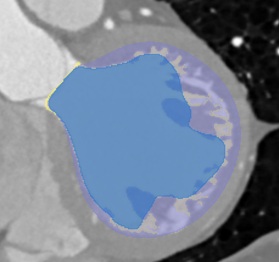

## Tobb iteraciora futtatva

Jonak tunik igy! Ugy tunik, hogy az utolso ket iteracio (5000 es 10000) alapjan konvergalt a maszk

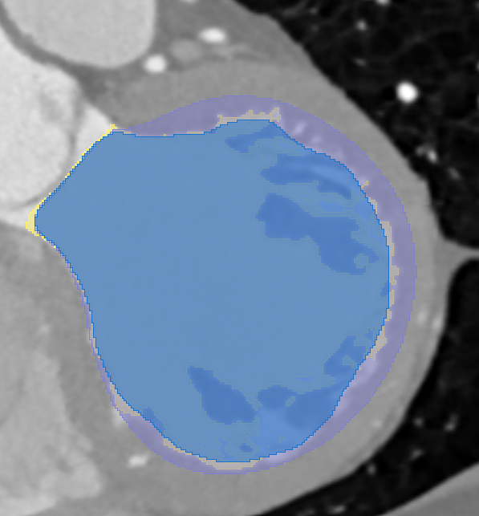

# patient_0007

Az eredeti maszk nem tokeletes -> nincs benne jellegzetes bemelyedes. A maszk egyebkent konvergalt.

Az eredeti felveltel is erdekes, keves szelet, a koronalis szeleten nehezen meghatarozhato, hogy hol vannak a szivizmok (GT alapjan sem ertelmezheto)

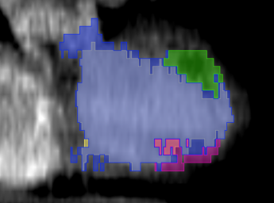

# patient_0008

Uj maszk robban rasimul az LV maszkra, mint a regi, viszont emiatt a bemelyedeseket se tolti ki teljesen.

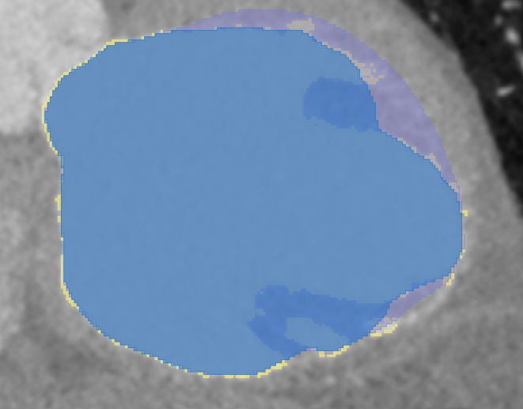

## Tobb iteraciora futtatva:

A ROI-hoz konvergal (vagy legalabbis 'kifolyik' a szivizom bemelyedesenel)

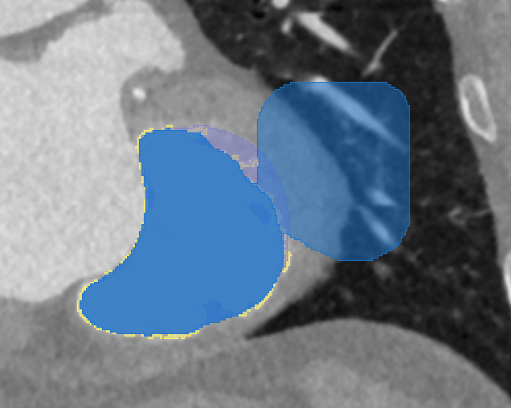

Tul nagy propagation scaling?

# patient_0009

Itt is kozelebb van az eredeti maszkhoz az uj GAC maszk. Kerdeses, hogy a regi, vagy az uj jobb (pl. kep), a zold szivizmot az uj se veszi be teljesen -> jo-e itt a szivizom szegmentacioja?

Az uj maszk nem konvergalt.

TODO: TOBB ITERACIOIG FUTTATNI!!!!

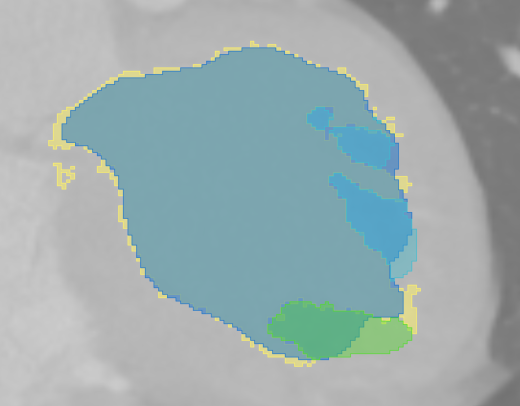

# patient_0010

Ugyanugy kozelebb van az eredeti maszkhoz. Itt viszont nem tudom pontosan megallapitani, hogy konvergalt-e mar vagy sem.

TODO: TOBB ITERACIO

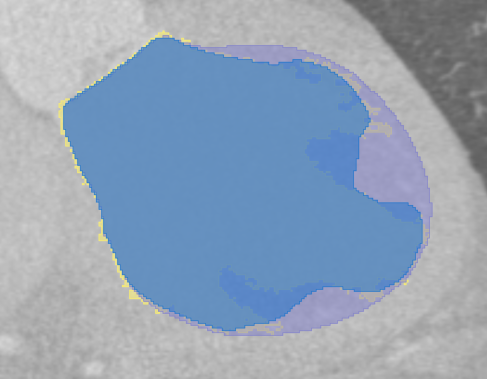

# patient_0011

Konvergal es jobban kimegy, mint a regi maszk. Erdekesseg, hogy a kepen levo szegmentacio axialis szeleten egy pupnak nez ki.

TODO: tobb iteracio

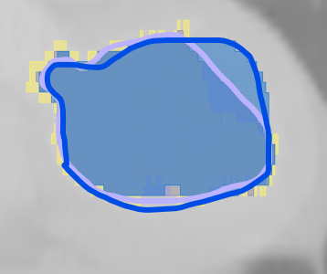
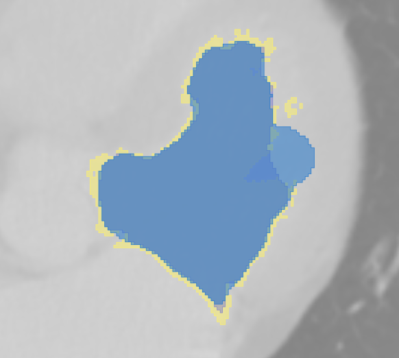

Egyebkent nem biztos, hogy konvergalt, ez is erdekes lehet. A szivizom formaja/bemelyedese itt is mas. GT nehezen ertelmezheto/indokolhato. Inkabb csak a helyezete alapjan azonosithato

# patient_0012

Itt is elobb megall, viszont szerintem nem konvergalt.

TODO: TOBB ITERACIO

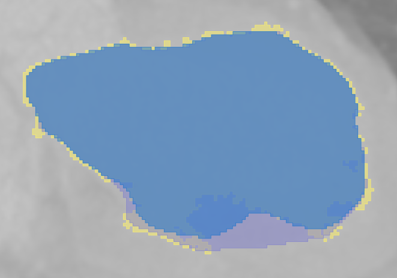

# patient_0013

Rossz CT

# patient_0014

Alapvetoen jo, de megjelennek puklik.

TODO: Tobb iteracio, mert lehet, hogy nem konvergalt

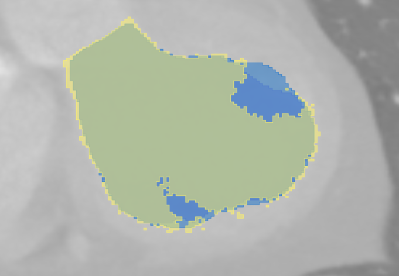

# patient_0015

A ket maszk kb. ugyanaz.

Result: OK

# patient_0016

Kicsit szerintem jobb, de egy pukli elkezdett megjelenni. Viszont konvergalt.

TODO: tobb iteracio, hogy BIZTOS konvergalt-e

# patient_0017

Jo/jobb, mint a regi. Konvergalas kerdojeles

TODO: tobb iteracio

# patient_0018

Konvergalt es jo

# patient_0019

Jobban rasimul az eredeti maszkra, ez egy helyen problemasnak tunik;

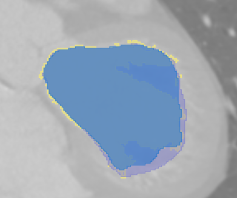

Konvergenciat erdemes ellenorizni.

TODO: tobb iteracio

# patient_0020

Alapvetoen jobb, meg a streaking ellen robosztusabb is (nem szegmental tul), viszont emiatt az egyik izomnal beesik;

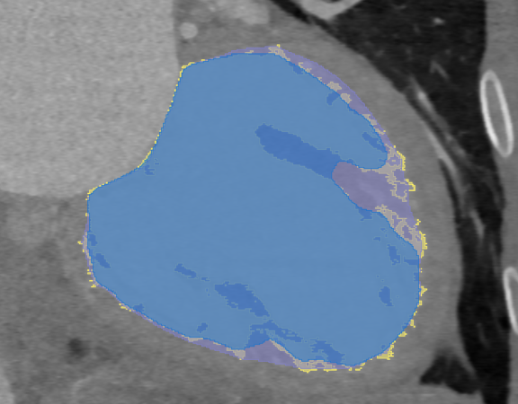

Szinte biztos, hogy nem konvergalt (viszont lassan indul!)

TODO: tobb iteracio

# patient_0021

Szerintem nem konvergalt

TODO: tobb iteracio

# patient_0022

Szukebben rajta van az eredeti maszkon, ami jo, viszont ez egy bizonyos szelet eseten rossz;

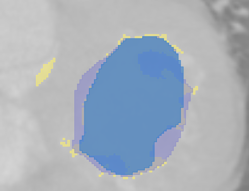

Iteraciokat megvizsgalva o se biztos, hogy konvergalt;

TODO: tobb iteracio