NOTE: A referenciamaszk az elozo, 1000 iteracioig futtatot GAC eredmenye

GAC_PARAMS = {
    "curvature_scaling": 1.00,
    "advection_scaling": 1.00,
    "propagation_scaling": 0.2976,
    "num_iterations": 1000,
    "max_rms_error": 0.0001
}

# patient_0001

A ket maszk kb. ugyanaz.

Result: OK

# patient_0002

Az uj maszk jobban rasimul az eredeti maszkra, nehol levagva reszeket, de ez szerintem nem rossz;

Az iteraciokat megvizsgalva konvergalt (a vegere mar minden d=50 iteracional csak par pixel valtozott adott szeleten, ami a szivizmot tartalmazta)

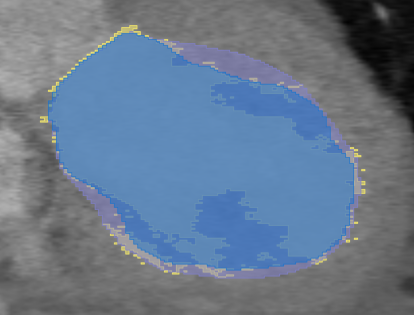

Result: OK

# patient_0003

A ket maszk kb. ugyanaz.

Result: OK

Update: 10k iteracional bubble jelenseg -> itt se jok a parameterek:(

# patient_0004

Az uj maszk kicsit jobban rasimul az eredetire. Itt viszont ez biztos, hogy jobb, mint a masik (ott a burok tulsagosan 'tulszegmental')

Result: OK

# patient_0005

A ket maszk kb. ugyanaz.

Result: OK

# patient_0006

Az eredeti maszk rossz, sok bemelyedes van benne, ami szerintem magyarazhatova teszi az eredmenyt. Itt is jobban 'alulszegmental' az uj maszk. Se az uj, se a regi nem jo, de ez inkabb az eredeti LV szegmentacio miatt van.

Erdekesseg: nem tunik ugy, mintha konvergalt volna. Itt eleinte a maszk alig valtozik, sot elkezd csokkenni, majd kesobb elkezd noni.

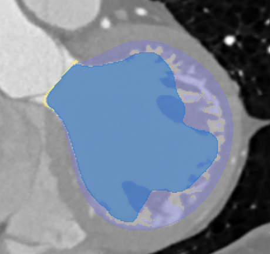

## Tobb iteraciora futtatva

Jonak tunik igy! Ugy tunik, hogy az utolso ket iteracio (5000 es 10000) alapjan konvergalt a maszk

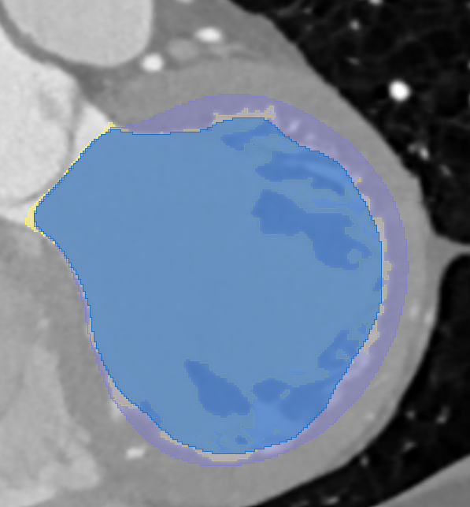

# patient_0007

Az eredeti maszk nem tokeletes -> nincs benne jellegzetes bemelyedes. A maszk egyebkent konvergalt.

Az eredeti felveltel is erdekes, keves szelet, a koronalis szeleten nehezen meghatarozhato, hogy hol vannak a szivizmok (GT alapjan sem ertelmezheto)

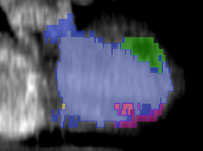

# patient_0008

Uj maszk robban rasimul az LV maszkra, mint a regi, viszont emiatt a bemelyedeseket se tolti ki teljesen.

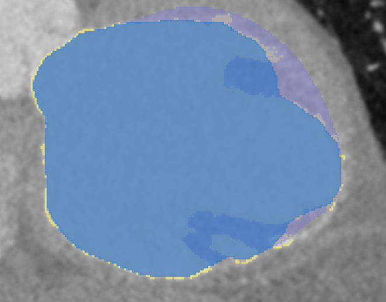

## Tobb iteraciora futtatva:

A ROI-hoz konvergal (vagy legalabbis 'kifolyik' a szivizom bemelyedesenel)

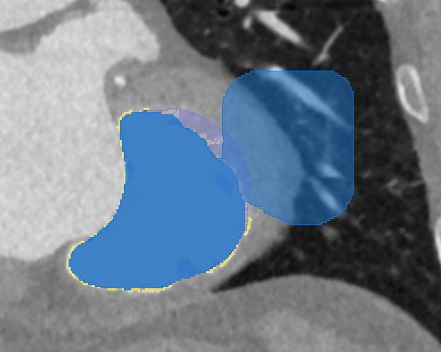

Tul nagy propagation scaling?
Tesztel scaling-ek (curv=adv=1.0):
- p0p0530 - 0
- p0p0706 - 1
- p0p0942 - 2
- p0p1255 - 3
- p0p1674 - 4
- p0p2232 - 5
- p0p2976 - 6

Kisebb prop eseten is kb. ugyanabba az iranyba konvergalnak -> pl. 2232 eseten kb latszik mar hogy ha tovabb tudna menni, akkor kialakulna a gomb -> simitani kell -> adv=1.0, prop=0.2976, curv:
- ...

# patient_0009

Itt is kozelebb van az eredeti maszkhoz az uj GAC maszk. Kerdeses, hogy a regi, vagy az uj jobb (pl. kep), a zold szivizmot az uj se veszi be teljesen -> jo-e itt a szivizom szegmentacioja?

Az uj maszk nem konvergalt.

TODO: TOBB ITERACIOIG FUTTATNI!!!!

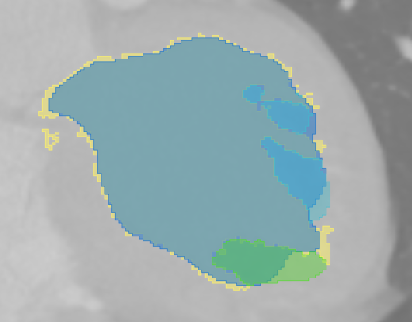

## Tobb iteraciora futtatva:

A ROI-hoz konvergal (vagy legalabbis 'kifolyik' a szivizom bemelyedesenel)

# patient_0010

Ugyanugy kozelebb van az eredeti maszkhoz. Itt viszont nem tudom pontosan megallapitani, hogy konvergalt-e mar vagy sem.

TODO: TOBB ITERACIO

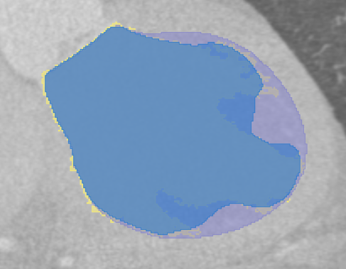

## Tobb iteraciora futtatva:

A ROI-hoz konvergal (vagy legalabbis 'kifolyik' a szivizom bemelyedesenel)

# patient_0011

Konvergal es jobban kimegy, mint a regi maszk. Erdekesseg, hogy a kepen levo szegmentacio axialis szeleten egy pupnak nez ki.

TODO: tobb iteracio

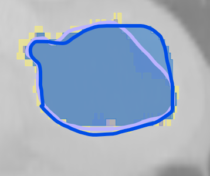
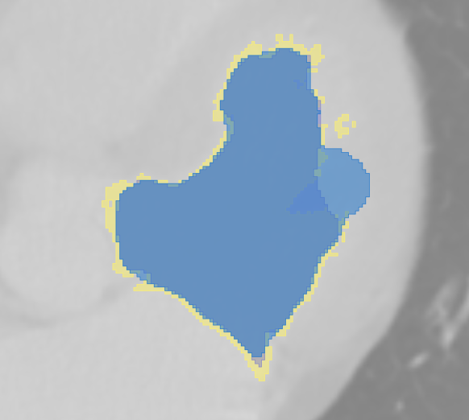

Egyebkent nem biztos, hogy konvergalt, ez is erdekes lehet. A szivizom formaja/bemelyedese itt is mas. GT nehezen ertelmezheto/indokolhato. Inkabb csak a helyezete alapjan azonosithato

## Tobb iteraciora futtatva:

A ROI-hoz konvergal (vagy legalabbis 'kifolyik' a szivizom bemelyedesenel)

# patient_0012

Itt is elobb megall, viszont szerintem nem konvergalt.

TODO: TOBB ITERACIO

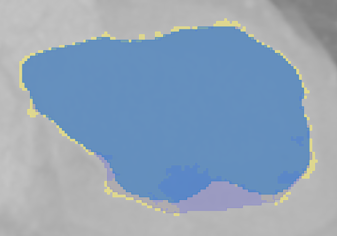

## Tobb iteraciora futtatva:

A ROI-hoz konvergal (vagy legalabbis 'kifolyik' a szivizom bemelyedesenel)

# patient_0013

Rossz CT

# patient_0014

Alapvetoen jo, de megjelennek puklik.

TODO: Tobb iteracio, mert lehet, hogy nem konvergalt

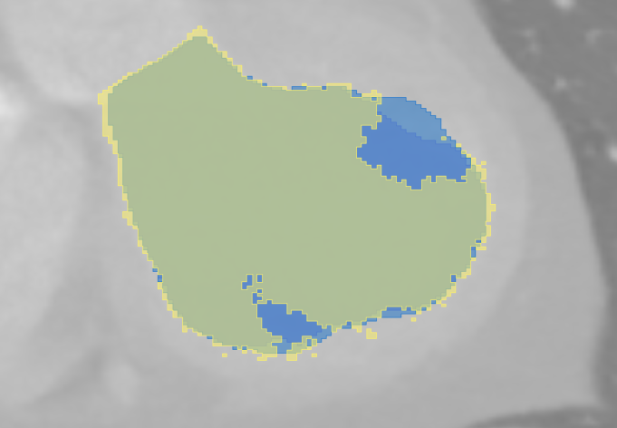

## Tobb iteraciora futtatva:

A ROI-hoz konvergal (vagy legalabbis 'kifolyik' a szivizom bemelyedesenel)

# patient_0015

A ket maszk kb. ugyanaz.

Result: OK

# patient_0016

Kicsit szerintem jobb, de egy pukli elkezdett megjelenni. Viszont konvergalt.

TODO: tobb iteracio, hogy BIZTOS konvergalt-e

## Tobb iteraciora futtatva:

A ROI-hoz konvergal (vagy legalabbis 'kifolyik' a szivizom bemelyedesenel)

# patient_0017

Jo/jobb, mint a regi. Konvergalas kerdojeles

TODO: tobb iteracio

## Tobb iteraciora futtatva:

A ROI-hoz konvergal (vagy legalabbis 'kifolyik' a szivizom bemelyedesenel)

# patient_0018

Konvergalt es jo

# patient_0019

Jobban rasimul az eredeti maszkra, ez egy helyen problemasnak tunik;

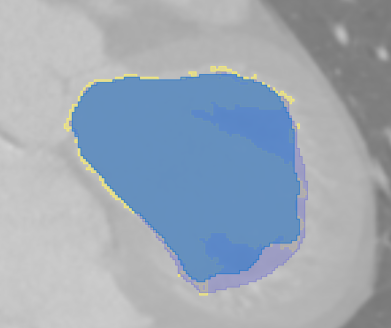

Konvergenciat erdemes ellenorizni.

TODO: tobb iteracio

## Tobb iteraciora futtatva:

A ROI-hoz konvergal (vagy legalabbis 'kifolyik' a szivizom bemelyedesenel)

# patient_0020

Alapvetoen jobb, meg a streaking ellen robosztusabb is (nem szegmental tul), viszont emiatt az egyik izomnal beesik;

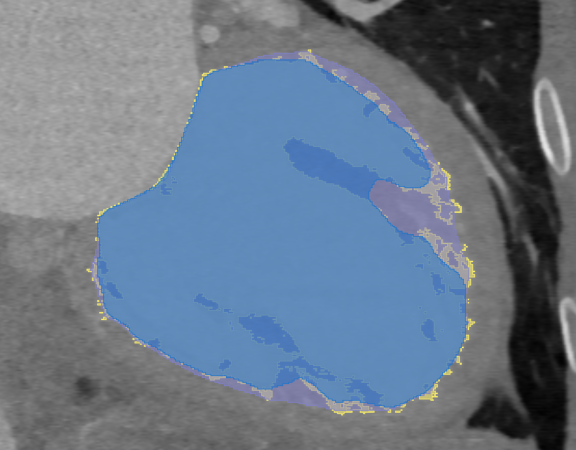

Szinte biztos, hogy nem konvergalt (viszont lassan indul!)

TODO: tobb iteracio

## Tobb iteraciora futtatva:

Rendesen konvergal!

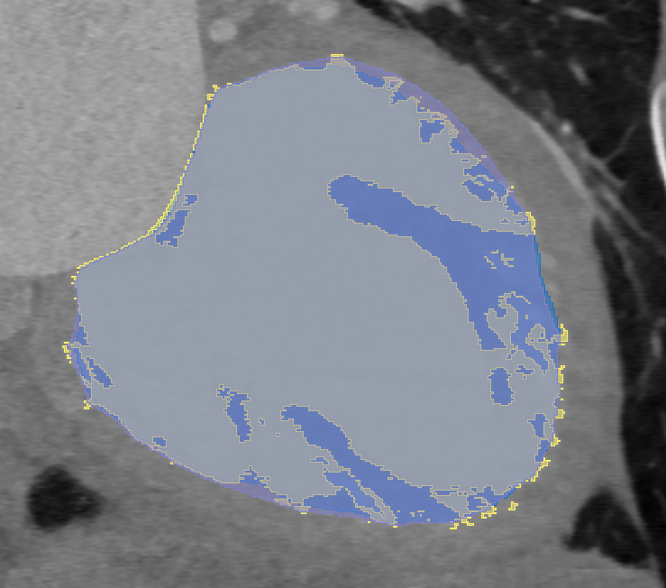

# patient_0021

Szerintem nem konvergalt

TODO: tobb iteracio

## Tobb iteraciora futtatva:

A ROI-hoz konvergal (vagy legalabbis 'kifolyik' a szivizom bemelyedesenel)

# patient_0022

Szukebben rajta van az eredeti maszkon, ami jo, viszont ez egy bizonyos szelet eseten rossz;

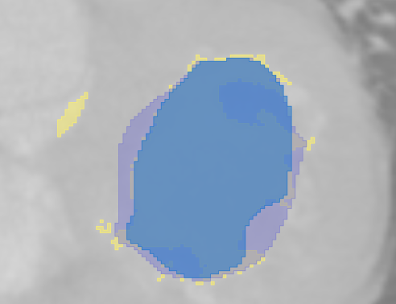

Iteraciokat megvizsgalva o se biztos, hogy konvergalt;

TODO: tobb iteracio

## Tobb iteraciora futtatva:

A ROI-hoz konvergal (vagy legalabbis 'kifolyik' a szivizom bemelyedesenel)

# Adaptive GAC
## patient_0001
Output:

        At iteration: 1000
        At iteration: 2000
        Converged at iteration: 2300!
        Run took 89.4543s

Note: Good

## patient_0002
Output:

        At iteration: 1000
        At iteration: 2000
        At iteration: 3000
        At iteration: 4000
        At iteration: 5000
        At iteration: 6000
        Converged at iteration: 6350!
        Run took 288.1606s

Note: Good

## patient_0003
Output:

        At iteration: 1000
        At iteration: 2000
        Bubble detected at iteration: 2900
        Touches ROI wall: False
        Proposed rollback value: 900 - distance: 4.960150241851807
        Example voxel (z, y, x): (272, 204, 301)
        Performing rollback to 650 of exp c1p0000_p0p2976_a1p0000
        New params:
                curvature_scaling: 1.50
                advection_scaling: 1.00
                propagation_scaling: 0.30
                num_iterations: 1000.00
                max_rms_error: 0.00
        At iteration: 1000
        At iteration: 2000
        At iteration: 3000
        Converged at iteration: 3450!
        Run took 169.1358s

Note: Good

## patient_0004
Output:

        At iteration: 1000
        At iteration: 2000
        At iteration: 3000
        Converged at iteration: 3700!
        Run took 568.9609s

Note: Good

## patient_0005
Output:

        At iteration: 1000
        At iteration: 2000
        Converged at iteration: 2600!
        Run took 188.0189s

Note: Good

## patient_0006
Output:

        At iteration: 1000
        At iteration: 2000
        At iteration: 3000
        At iteration: 4000
        At iteration: 5000
        At iteration: 6000
        At iteration: 7000
        Converged at iteration: 7050!
        Run took 654.1928s

Note: Rossz kezdeti LV maszk. Jo eredmeny.

## patient_0007
Output:

        At iteration: 1000
        At iteration: 2000
        Converged at iteration: 2250!
        Run took 30.9468s

Note: Erdekes LV szegmentacio - legalabbis koronalis szeletet tekintve. Maszk alig mozdul -> Early convergence detection?

## patient_0008
Output:

        At iteration: 1000
        At iteration: 2000
        Converged at iteration: 2450!
        Run took 213.8573s

Note: Konvergal egy olyan param set-tel, ami igazabol bubble-t eredmenyzene. "Good".

## patient_0009
Output:

        At iteration: 1000
        Bubble detected at iteration: 1800
        Touches ROI wall: True
        Proposed rollback value: 650 - distance: 4.747989654541016
        Performing rollback to 400 of exp c1p0000_p0p2976_a1p0000
        New params:
                curvature_scaling: 1.50
                advection_scaling: 1.00
                propagation_scaling: 0.30
                num_iterations: 1000.00
                max_rms_error: 0.00
        At iteration: 1000
        At iteration: 2000
        At iteration: 3000
        Bubble detected at iteration: 3850
        Touches ROI wall: True
        Proposed rollback value: 850 - distance: 4.869833946228027
        Performing rollback to 400 of exp c1p0000_p0p2976_a1p0000
        New params:
                curvature_scaling: 2.25
                advection_scaling: 1.00
                propagation_scaling: 0.30
                num_iterations: 1000.00
                max_rms_error: 0.00
        At iteration: 1000
        At iteration: 2000
        At iteration: 3000
        At iteration: 4000
        At iteration: 5000
        At iteration: 6000
        At iteration: 7000
        At iteration: 8000
        At iteration: 9000
        Converged at iteration: 9050!
        Run took 617.6615s

Note: Good, de egy helyen ugy latszik mintha kezdene kialakulni a lufi. Ez nem feltetlen(?) baj.

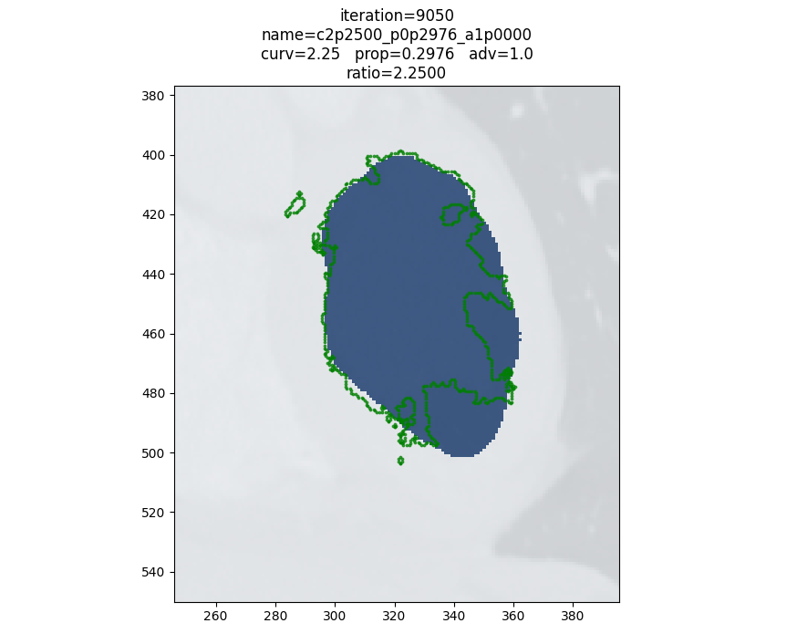

## patient_0010
Output:

        At iteration: 1000
        At iteration: 2000
        At iteration: 3000
        At iteration: 4000
        Bubble detected at iteration: 4150
        Touches ROI wall: True
        Proposed rollback value: 1000 - distance: 4.958131790161133
        Performing rollback to 750 of exp c1p0000_p0p2976_a1p0000
        New params:
                curvature_scaling: 1.50
                advection_scaling: 1.00
                propagation_scaling: 0.30
                num_iterations: 1000.00
                max_rms_error: 0.00
        At iteration: 1000
        At iteration: 2000
        At iteration: 3000
        At iteration: 4000
        At iteration: 5000
        At iteration: 6000
        At iteration: 7000
        Converged at iteration: 7700!
        Run took 897.0285s

Note: Good, de itt is kezd valami bubble forma latszani (patient_0009)
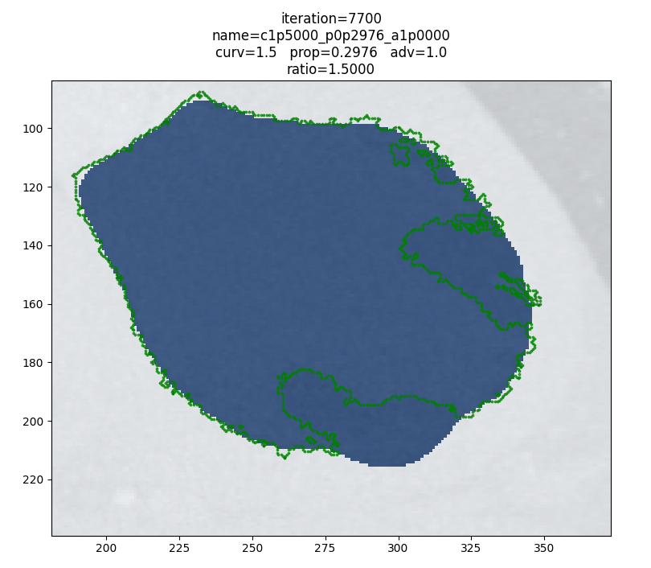

## patient_0011
Output:

        At iteration: 1000
        Bubble detected at iteration: 1600
        Touches ROI wall: True
        Proposed rollback value: 500 - distance: 4.997868061065674
        Performing rollback to 250 of exp c1p0000_p0p2976_a1p0000
        New params:
                curvature_scaling: 1.50
                advection_scaling: 1.00
                propagation_scaling: 0.30
                num_iterations: 1000.00
                max_rms_error: 0.00
        At iteration: 1000
        At iteration: 2000
        Converged at iteration: 2250!
        Run took 57.8648s

Note: Good

## patient_0012
Output:

        At iteration: 1000
        At iteration: 2000
        Bubble detected at iteration: 2750
        Touches ROI wall: True
        Proposed rollback value: 1000 - distance: 4.875160217285156
        Performing rollback to 750 of exp c1p0000_p0p2976_a1p0000
        New params:
                curvature_scaling: 1.50
                advection_scaling: 1.00
                propagation_scaling: 0.30
                num_iterations: 1000.00
                max_rms_error: 0.00
        At iteration: 1000
        At iteration: 2000
        At iteration: 3000
        At iteration: 4000
        At iteration: 5000
        At iteration: 6000
        Converged at iteration: 6500!
        Run took 280.8136s

Note: Good, de a bubble itt is latszik kb. Bar itt magyarazhato
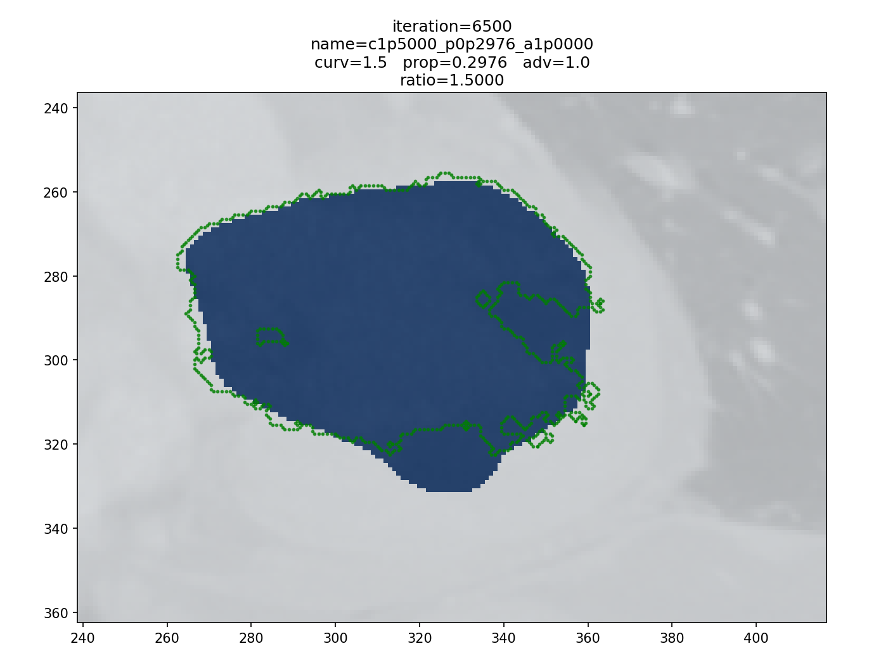

## patient_0013
Output:

        At iteration: 1000
        Converged at iteration: 1550!
        Run took 42.4958s

Note: Rossz CT-n rossz LV maszk. De lefut - helyesen. Jo alap arra, hogy mi tortenik ezzel a paramset-tel, ha nincs bemelyedes (prop (+ curv?) eleg eros ahhoz, hogy a kezdeti helyen tartsa a maszkot).

## patient_0014
Output:

        At iteration: 1000
        At iteration: 2000
        Bubble detected at iteration: 2000
        Touches ROI wall: True
        Proposed rollback value: 450 - distance: 4.759858131408691
        Performing rollback to 200 of exp c1p0000_p0p2976_a1p0000
        New params:
                curvature_scaling: 1.50
                advection_scaling: 1.00
                propagation_scaling: 0.30
                num_iterations: 1000.00
                max_rms_error: 0.00
        At iteration: 1000
        At iteration: 2000
        At iteration: 3000
        Converged at iteration: 3300!
        Run took 160.5114s

Note: Goo

## patient_0015
Output:

        At iteration: 1000
        At iteration: 2000
        Converged at iteration: 2550!
        Run took 122.7959s

Note: Good

## patient_0016
Output:

        At iteration: 1000
        At iteration: 2000
        Bubble detected at iteration: 2450
        Touches ROI wall: True
        Proposed rollback value: 800 - distance: 4.904951572418213
        Performing rollback to 550 of exp c1p0000_p0p2976_a1p0000
        New params:
                curvature_scaling: 1.50
                advection_scaling: 1.00
                propagation_scaling: 0.30
                num_iterations: 1000.00
                max_rms_error: 0.00
        At iteration: 1000
        At iteration: 2000
        At iteration: 3000
        At iteration: 4000
        Converged at iteration: 4550!
        Run took 156.4347s

Note: Good. Talan kicsi bubble?
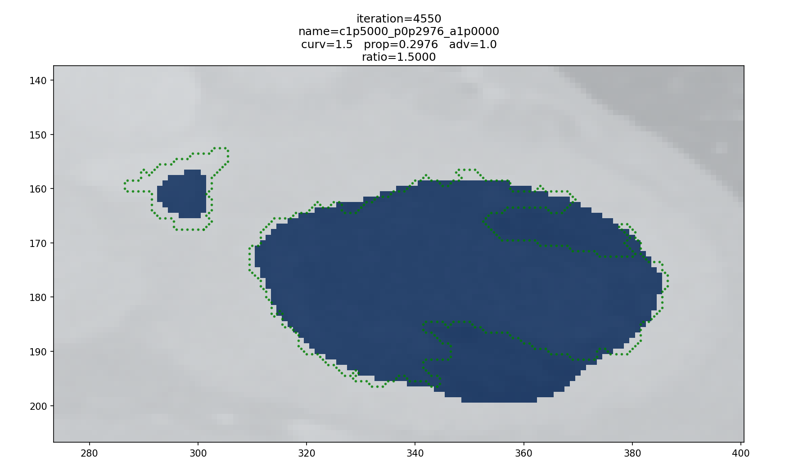

## patient_0017
Output:

        At iteration: 1000
        At iteration: 2000
        Bubble detected at iteration: 2650
        Touches ROI wall: True
        Proposed rollback value: 650 - distance: 4.847691059112549
        Performing rollback to 400 of exp c1p0000_p0p2976_a1p0000
        New params:
                curvature_scaling: 1.50
                advection_scaling: 1.00
                propagation_scaling: 0.30
                num_iterations: 1000.00
                max_rms_error: 0.00
        At iteration: 1000
        At iteration: 2000
        Converged at iteration: 2650!
        Run took 59.7538s

Note: Good (kicsit torzitott koronalis szelet, nehezebb megmondani)

## patient_0018
Output:

        At iteration: 1000
        At iteration: 2000
        Converged at iteration: 2850!
        Run took 92.7089s

Note: Good

## patient_0019
Output:

        At iteration: 1000
        At iteration: 2000
        Bubble detected at iteration: 2900
        Touches ROI wall: False
        Proposed rollback value: 800 - distance: 4.9019622802734375
        Example voxel (z, y, x): (333, 195, 412)
        Performing rollback to 550 of exp c1p0000_p0p2976_a1p0000
        New params:
                curvature_scaling: 1.50
                advection_scaling: 1.00
                propagation_scaling: 0.30
                num_iterations: 1000.00
                max_rms_error: 0.00
        At iteration: 1000
        At iteration: 2000
        At iteration: 3000
        At iteration: 4000
        Converged at iteration: 4400!
        Run took 253.0886s

Note: Good, kicsi bubble mintha kezdene kialakulni, talan magyarazhato?
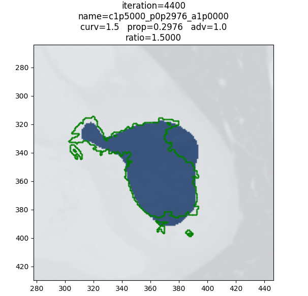

## patient_0020
Output:

        At iteration: 1000
        At iteration: 2000
        At iteration: 3000
        At iteration: 4000
        At iteration: 5000
        At iteration: 6000
        At iteration: 7000
        Converged at iteration: 7500!
        Run took 1434.0654s

Note: Good. Tul lassu -> tul mely szivizmok miatt?

## patient_0021
Output:

        At iteration: 1000
        At iteration: 2000
        Bubble detected at iteration: 2550
        Touches ROI wall: False
        Proposed rollback value: 800 - distance: 4.766111850738525
        Example voxel (z, y, x): (418, 211, 341)
        Performing rollback to 550 of exp c1p0000_p0p2976_a1p0000
        New params:
                curvature_scaling: 1.50
                advection_scaling: 1.00
                propagation_scaling: 0.30
                num_iterations: 1000.00
                max_rms_error: 0.00
        At iteration: 1000
        At iteration: 2000
        At iteration: 3000
        At iteration: 4000
        Bubble detected at iteration: 4650
        Touches ROI wall: False
        Proposed rollback value: 1550 - distance: 4.865890979766846
        Example voxel (z, y, x): (419, 212, 341)
        Performing rollback to 550 of exp c1p0000_p0p2976_a1p0000
        New params:
                curvature_scaling: 2.25
                advection_scaling: 1.00
                propagation_scaling: 0.30
                num_iterations: 1000.00
                max_rms_error: 0.00
        At iteration: 1000
        At iteration: 2000
        Converged at iteration: 2850!
        Run took 291.0293s

Note: Tul hamar konvergal. Valoszinuleg 1.5 es 2.25 kozott van a jo prop value? Kell early convergence detection
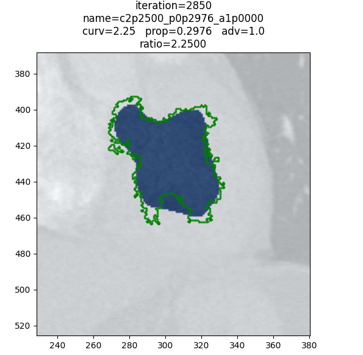

## patient_0022
Output:

        At iteration: 1000
        At iteration: 2000
        Bubble detected at iteration: 2500
        Touches ROI wall: True
        Proposed rollback value: 450 - distance: 4.681895732879639
        Performing rollback to 200 of exp c1p0000_p0p2976_a1p0000
        New params:
                curvature_scaling: 1.50
                advection_scaling: 1.00
                propagation_scaling: 0.30
                num_iterations: 1000.00
                max_rms_error: 0.00
        At iteration: 1000
        At iteration: 2000
        At iteration: 3000
        At iteration: 4000
        At iteration: 5000
        At iteration: 6000
        Converged at iteration: 6750!
        Run took 289.7664s

Note: Good, de itt is a bubble dolog talan feljon? Bar itt szerintem foleg nem rossz.
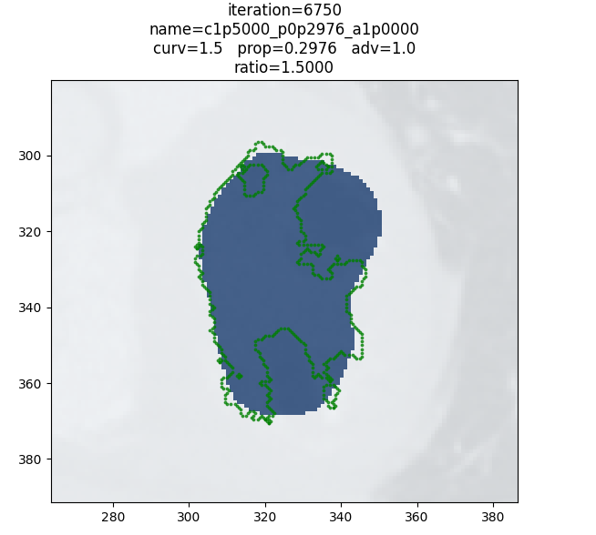

## patient_0023
Output:
	At iteration: 1000
	Bubble detected at iteration: 1550
	Touches ROI wall: True
	Proposed rollback value: 900 - distance: 4.894726753234863
	Performing rollback to 650 of exp c1p0000_p0p2976_a1p0000
	New params:
		curvature_scaling: 1.50
		advection_scaling: 1.00
		propagation_scaling: 0.30
		num_iterations: 1000.00
		max_rms_error: 0.00
	At iteration: 1000
	At iteration: 2000
	At iteration: 3000
	At iteration: 4000
	Converged at iteration: 4050!
	Run took 54.2924s
Note: Good, de
A masodik (AL) izmot nem talalja meg az algoritmus. Ennek az az oka, hogy a CT rossz -> nincs ott bemelyedes/minimalis -> GAC nem fedi be. A masik izom eseten jol fut
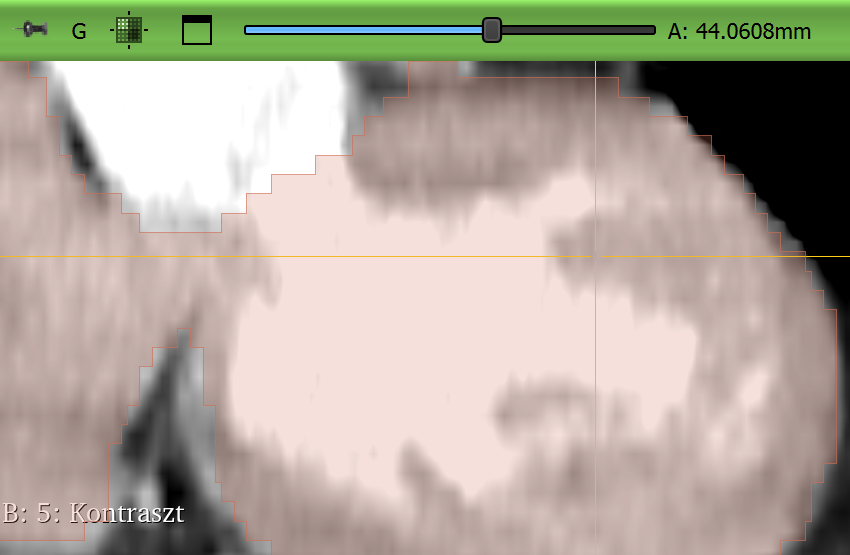
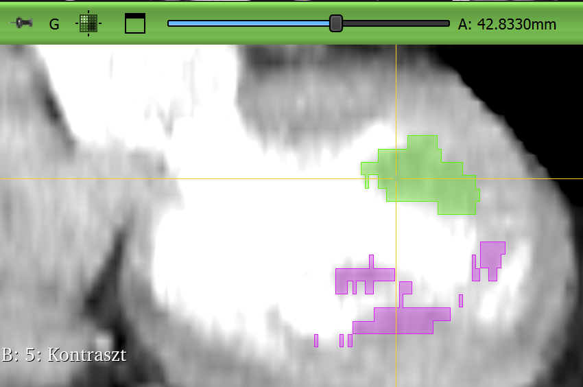

## patient_0024
Output:

	At iteration: 1000
	At iteration: 2000
	Converged at iteration: 2650!
	Run took 79.5709s

Note: Good

## patient_0026
Output:

	At iteration: 1000
	At iteration: 2000
	At iteration: 3000
	Bubble detected at iteration: 3050
	Touches ROI wall: False
	Proposed rollback value: 950 - distance: 4.572650909423828
	Example voxel (z, y, x): (626, 230, 338)
	Performing rollback to 700 of exp c1p0000_p0p2976_a1p0000
	New params:
		curvature_scaling: 1.50
		advection_scaling: 1.00
		propagation_scaling: 0.30
		num_iterations: 1000.00
		max_rms_error: 0.00
	At iteration: 1000
	At iteration: 2000
	At iteration: 3000
	At iteration: 4000
	At iteration: 5000
	Bubble detected at iteration: 5150
	Touches ROI wall: False
	Proposed rollback value: 1150 - distance: 4.827953338623047
	Example voxel (z, y, x): (627, 229, 339)
	Performing rollback to 700 of exp c1p0000_p0p2976_a1p0000
	New params:
		curvature_scaling: 2.25
		advection_scaling: 1.00
		propagation_scaling: 0.30
		num_iterations: 1000.00
		max_rms_error: 0.00
	At iteration: 1000
	At iteration: 2000
	At iteration: 3000
	At iteration: 4000
	At iteration: 5000
	Converged at iteration: 5150!
	Run took 1351.6854s

Note: Good, szokasos kisebb pukli. Ez kb. kovetkezik a maszk alakjabol

## patient_0027
Output:

	At iteration: 1000
	At iteration: 2000
	At iteration: 3000
	Bubble detected at iteration: 3000
	Touches ROI wall: False
	Proposed rollback value: 900 - distance: 4.918724060058594
	Example voxel (z, y, x): (375, 208, 296)
	Performing rollback to 650 of exp c1p0000_p0p2976_a1p0000
	New params:
		curvature_scaling: 1.50
		advection_scaling: 1.00
		propagation_scaling: 0.30
		num_iterations: 1000.00
		max_rms_error: 0.00
	At iteration: 1000
	At iteration: 2000
	At iteration: 3000
	At iteration: 4000
	At iteration: 5000
	At iteration: 6000
	At iteration: 7000
	Converged at iteration: 7600!
	Run took 310.3336s

Note: Good

## patient_0028
Output:

	At iteration: 1000
	Bubble detected at iteration: 1400
	Touches ROI wall: True
	Proposed rollback value: 350 - distance: 4.945931911468506
	Performing rollback to 100 of exp c1p0000_p0p2976_a1p0000
	New params:
		curvature_scaling: 1.50
		advection_scaling: 1.00
		propagation_scaling: 0.30
		num_iterations: 1000.00
		max_rms_error: 0.00
	At iteration: 1000
	At iteration: 2000
	At iteration: 3000
	Bubble detected at iteration: 3100
	Touches ROI wall: False
	Proposed rollback value: 500 - distance: 4.828218936920166
	Example voxel (z, y, x): (86, 199, 347)
	Performing rollback to 100 of exp c1p0000_p0p2976_a1p0000
	New params:
		curvature_scaling: 2.25
		advection_scaling: 1.00
		propagation_scaling: 0.30
		num_iterations: 1000.00
		max_rms_error: 0.00
	At iteration: 1000
	At iteration: 2000
	At iteration: 3000
	Converged at iteration: 3850!
	Run took 77.6429s

Note: Rossz CT -> a maszk alakja megint elfedi az egyik izmot (orvos maszknal is) -> GAC 'rosszul' fut / masik izmot egyebkent jol tomi be (AL).

## patient_0029
Output:

	At iteration: 1000
	Bubble detected at iteration: 1400
	Touches ROI wall: True
	Proposed rollback value: 350 - distance: 4.945931911468506
	Performing rollback to 100 of exp c1p0000_p0p2976_a1p0000
	New params:
		curvature_scaling: 1.50
		advection_scaling: 1.00
		propagation_scaling: 0.30
		num_iterations: 1000.00
		max_rms_error: 0.00
	At iteration: 1000
	At iteration: 2000
	At iteration: 3000
	Bubble detected at iteration: 3100
	Touches ROI wall: False
	Proposed rollback value: 500 - distance: 4.828218936920166
	Example voxel (z, y, x): (86, 199, 347)
	Performing rollback to 100 of exp c1p0000_p0p2976_a1p0000
	New params:
		curvature_scaling: 2.25
		advection_scaling: 1.00
		propagation_scaling: 0.30
		num_iterations: 1000.00
		max_rms_error: 0.00
	At iteration: 1000
	At iteration: 2000
	At iteration: 3000
	Converged at iteration: 3850!
	Run took 78.0643s

Note: Ugyanaz a felvetel, mint 0028

## patient_0030
Output:

	At iteration: 1000
	Bubble detected at iteration: 1550
	Touches ROI wall: False
	Proposed rollback value: 300 - distance: 4.650102615356445
	Example voxel (z, y, x): (292, 213, 365)
	Performing rollback to 50 of exp c1p0000_p0p2976_a1p0000
	New params:
		curvature_scaling: 1.50
		advection_scaling: 1.00
		propagation_scaling: 0.30
		num_iterations: 1000.00
		max_rms_error: 0.00
	At iteration: 1000
	At iteration: 2000
	Bubble detected at iteration: 2700
	Touches ROI wall: False
	Proposed rollback value: 350 - distance: 4.932283401489258
	Example voxel (z, y, x): (293, 205, 366)
	Performing rollback to 50 of exp c1p0000_p0p2976_a1p0000
	New params:
		curvature_scaling: 2.25
		advection_scaling: 1.00
		propagation_scaling: 0.30
		num_iterations: 1000.00
		max_rms_error: 0.00
	At iteration: 1000
	At iteration: 2000
	At iteration: 3000
	At iteration: 4000
	Converged at iteration: 4650!
	Run took 511.0703s

Note: Good, itt talan kicsit tul nagy a konvergencia ellenere a buborek?

# kiertekeles
(LV, muscle -> legyen ilyen modell mindkettore egyszerre betanitva)
yuki vs nnunet
yuki vs threshold
szamok: dice, iou, Hausdorff distance
derivaltas kuszobolos cikk kell

residual vagy skip connection van-e az nnunet-ben (Gabornak uzenet)

# MUSCLE SEGMENTATION
## patient_0001
LV:
- jo, hasonlit az orvoshoz
Izom:
- AL: Jonak tunik. GT szerintem alulszegmental
- PM: Jonak tunik, kiveve a kepen (itt bizonytalan). Nehol tulszegmental az GT, valahol pedig nem (itt nem biztos, hogy kell, kep->). Itt az GT is picit beleszegmental. HU ertekeket nezve ez hatareset, hogy melyik kell/jo.

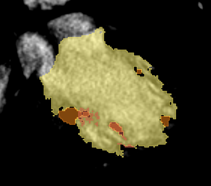

## patient_0002
LV:

- jo, hasonlit az GT-hez
- streaking utan a hid nagyon minimalis resze bennemarad. Szerintem ezt nem nagyon lehet kivedeni

Izom:

- AL: jo, az GT-vel kb. hasonlo. Egy ponton szerintem GT tulszegmental;
- PM: jo, hasonlo kb. GT-ben nem connected component ez az izom -> rossz(?)

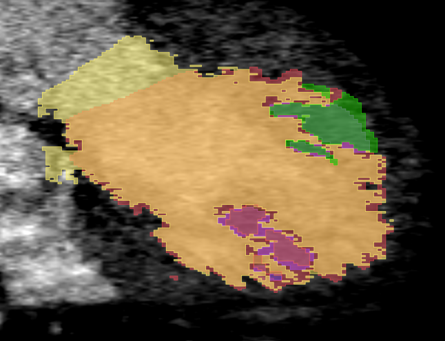

## patient_0003
LV:
- Talan kicsit tulszegmental, mint GT. A CT-t elnezve ez nem feltetlen rossz
Izom:
- AL: Logika alapjan jo, GT teljesen rossz (lokacio)
- PM: Logika alapjan jo, GT teljesen rossz (lokacio)

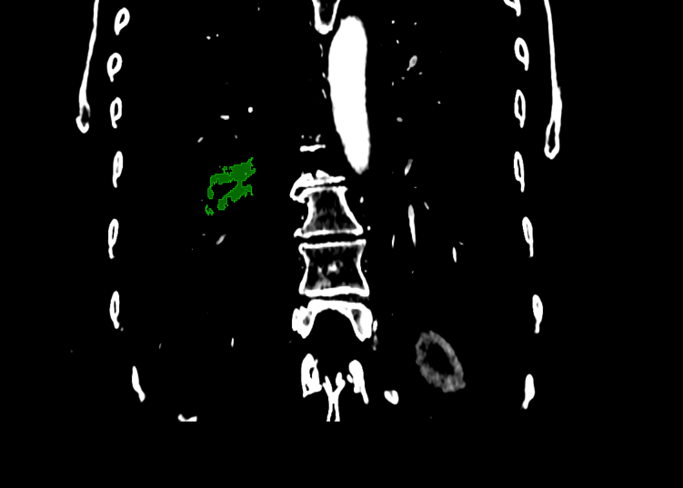

## patient_0004
LV:
- Itt a streaking-et a postproc alg se tudta tokeletesen eltavolitani. Emiatt ott van elteres, egyebkent jo.

Izom:
- A streaking-es dolog miatt a konvex burok rossz -> lesz egy hatalmas komponens axialis szeleten a streaking-nel, ami emiatt 'izom' lesz. Egyebkent ez kiszurheto szerintem. A GT AL esetben alul, PM esetben tulszegmental szerintem.

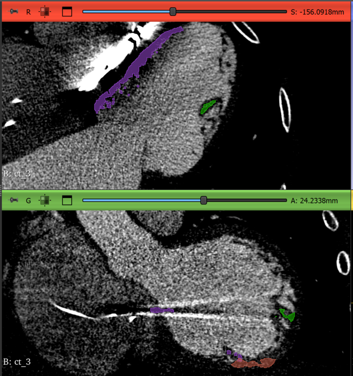

## patient_0005
LV:
- jo, kb. ugyanazok
- streaking egy ponton 'belevag' a maszkba. Ezt egyebkent a konvex burok befedi

Izom:
- AL: jo, GT alulszegmental
- PM: jo, GT alulszegmental
- Megjegyzes: Mostani ellenorzesben diff-et morph. close-oltam. Ugy az AL izom szetvalt ket kulon komponensre -> ezek lettek a legnagyobbak. A morph closing elhagyasaval megoldodott a problema, viszont igy lesznek reszek PM eseten, akik 'gyengen' kapcsolodnak a fo strukturahoz -> adott DT erteku hidak torlese -> legnagyobb komponensek megtartasa?

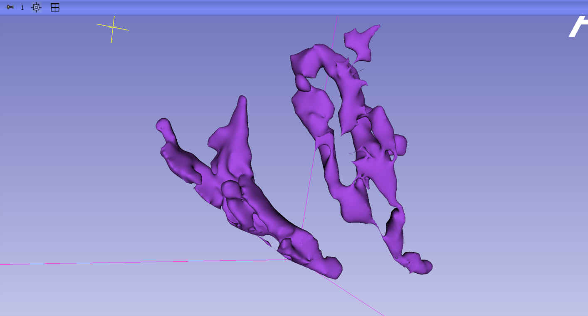

## patient_0006
LV:
- Erdekesebb CT, a postproc a kepen lathato okbol levag neha darabokat. Viszont jobb a szegmentacio, mint a GT (befalazza az izmokat)

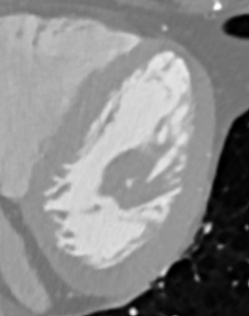

Izmok:
- AL: Lokaciora jo, GT alulszegmental, de jobban. Tul nagy az izom merete de ez jon az LV szegmentaciobol
- PM: Lokaciora jo, meretre is. Hasonlit GT-re.

## patient_0007
LV:
- jo, hasonlit GT-re

Izmok:
- AL: -
- PM: -
- Note: Az LV maszk jo, viszont nincs/alig van bemelyedese. Egyedul AL-nel lathato bemelyedes, viszont a GAC az inicializalt helyzeteben maradt. Kene early conv detection -> nagyobb prop value, ez lehet megoldja. Ugyanakkor csak AL-t, PM-nek nincs (GT-ben) sem bemelyedes.

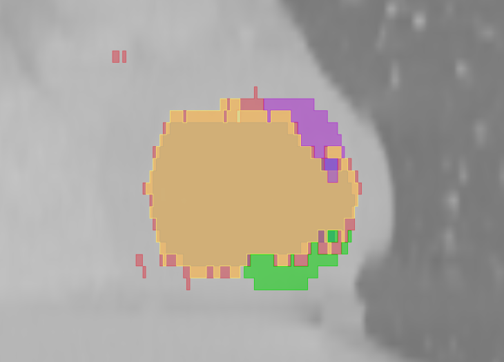

## patient_0008
LV:
- jo, ugyanaz, mint GT

Izom:
- AL: jo, GT szerintem tulszegmental
- PM: jo, GT szerintem tulszegmental

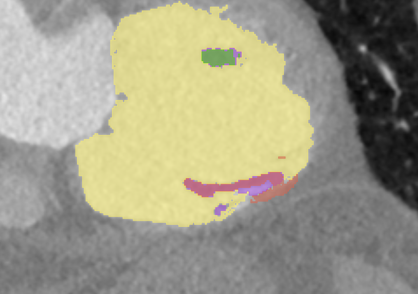

## patient_0009
LV:
- jo, GT-vel ugyanaz

Izom:
- AL: jo, viszont van egy kerdojeles resz (kep). Ezek 3D-ben connected-ek.
- PM: jo lokaciora
- Note: van egy problema. A ket betomott resz egy ponton osszeer. (kepen kijelolve). Emiatt azokat egy komponensek veszi - es egy masik kisebb komponens bejon. A maszk tulajdonsaga miatt szerintem a konvex burok tulsagosan kijon es ez biztositja par szeleten az atnyulast. Valahogy szet kene vagni. Otlet: Izmok lokaciojanak kijelolese: koronalis szeleten kozeppont felett/alatt, feluton BIZTOS elvagva. vagy valami ilyesmi

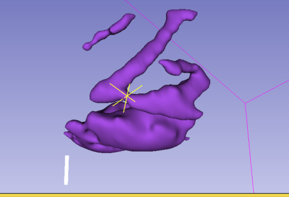

## patient_0010
LV:
- jo, GT viszont befalazza az izmokat

Izom:
- AL: jo, GT alulszegmental
- PM: jo, GT alulszegmental