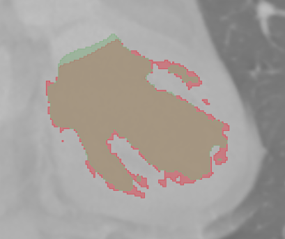

# patient_0001
- doc-fold-threshold hasonlitanak
- erdekesseg a szivizmok eseten:
    - 3d-ben nezve nagyon vekony a hid, ami kozrefogja

# patient_0002
- harom maszk nagyreszt hasonlo
# patient_0003
- u.a
# patient_0004
- u.a.
- streaking ugyanugy hat ra
# patient_0005
- u.a
# patient_0006
- itt jobb az nnunet
# patient_0007
- u.a
- talan meg (eddigiekkel egyutt) abban van kulonbseg, hogy axialis szeleten az LV maszk alja lentebb van
# patient_0008
- u.a
# patient_0009
- u.a
# patient_0010
- orvos maszkja teljesen zart -> szivizom miatt rossz
- nnunet inference es threshold maszk nem
- sztem itt is az nnunet kicsivel jobb
# patient_0011
- zartabb a ket maszk (doc nnunet) - szivizom szempontjabol
    - de ez kb. magyarazhato?
- egyebkent nnunet es threshold kb. ugyanaz
# patient_0012
- u.a.
# patient_0014
- majdnem be van zarva az egyik szivizom
- kerdojeles, hogy azon a reszen (koronalis szelet) melyik a jobb - tr. vagy nnunet
# patient_0015
- u.a.
# patient_0016
- szerintem itt doc befalaz egy szivizmot
- nnunet es threshold nem. kb ugyanazok
# patient_0017
- talan threshold jobb
- nehez eldonteni
# patient_0018
- u.a.
# patient_0019
- 2 komponens (egy messze van az LV-tol) nnunet altal - javithato egyszeruen egyebkent
- threshold szerintem alulszegmental, nnunet es orvos tul
# patient_0020
- nnunet nem erzkeny itt streaking-re egyebkent u.a. kb
# patient_0021
- u.a. kb
# patient_0022
- kb. ugyanaz, kicsit alabbszegmental a threshold, de ez nem tunik rossznak
- olyan mint nnunet = threshold * closed/rolling ball
# patient_0023
- kicsit tulszgemental nnunet szerintem
# patient_0024
- szinte befalazza az egyik izmot az nnunet - orvos nem, se threshold
- ezt leszamitva hasonlitanak
# patient_0026
- u.a
# patient_0027
- picit erdekesebb, de amugy ugyanaz
# patient_0029
- alsobb szivizmot szinte teljesen betomi
# patient_0030
- u.a.
# patient_0031
- tulszegmental es befed szivizmot
# patient_0033
- u.a.
# patient_0035
- itt szivizom szempontbol lehet az nnunet jobb
- egyebkent alacsony kontrasztu a felvetel
- nnunet alulszegmental threshold es dochoz kepest
# patient_0036
- patient_0035-hoz hasonlo
# patient_0037
- u.a.
# patient_0038
- nnunet alulszegmental
# patient_0039
- kb. u.a.
# patient_0040
- u.a.
# patient_0041
- nnunet tulszegmental
# patient_0042
- kb. u.a. (sajnos itt maradt meg a streaking a threshold maszkban)
# patient_0044
- rossz orvos maszk (bennemaradt veletlen) - a maszk ossze van menve gyakorlatilag
# patient_0045
- gyakorlatilag betomi a szivizmot az nnunet
# patient_0047
- u.a.
# patient_0048
- kb. ugyanaz - nnunet jobban betomi a szivizmokat (a bemelyedes felett van kisebb hid), de kontrasztbol lathato, hogy miert
# patient_0049
- u.a.
# patient_0050
- u.a.
- doc eseteben a szivizom jobban be van fedve - koronalis szeleten nezve, 3D-ben nem nez ki rosszul
# patient_0051
- jobban betomi az nnunet, de egyebkent u.a.
# patient_0052
- kb. u.a., mintha nnunet alulszegmentalna kicsit